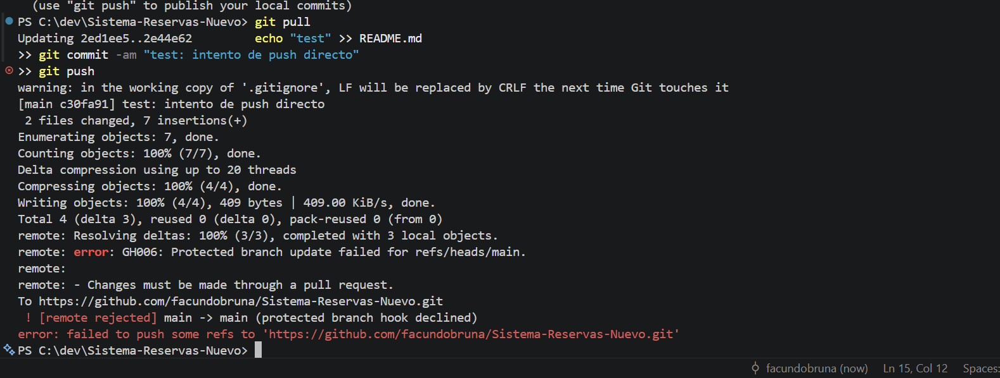
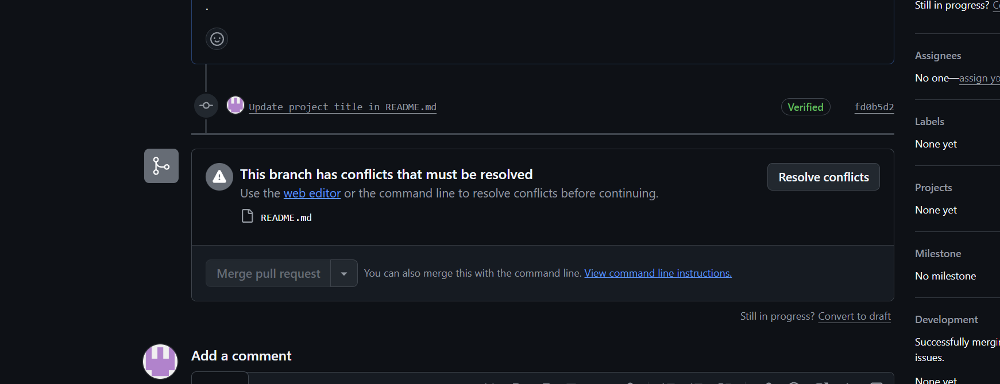
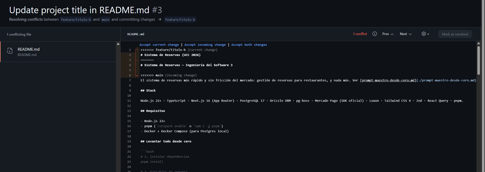
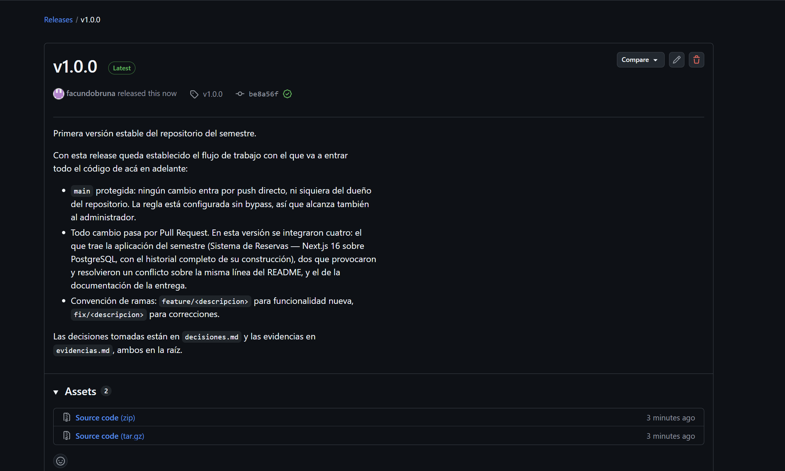

# Evidencias — Ingeniería del Software 3 (UCC 2026)

Capturas y salidas que respaldan cada TP. Se acumulan hacia abajo, igual que `decisiones.md`.

---

## TP1 — Git colaborativo

### 1. Push directo a `main` rechazado



Intento de `git push` directo sobre `main` estando parado en la rama protegida. GitHub lo rechaza
con `protected branch hook declined`: la regla exige que todo cambio entre por Pull Request, y con
*Do not allow bypassing* activado alcanza **también al dueño del repositorio**. Una protección que
el administrador puede saltear no protege nada.

Comando ejecutado:

```
echo "test" >> README.md
git commit -am "test: intento de push directo"
git push
```

### 2. El Pull Request de la rama B no se puede mergear: conflicto



`feature/titulo-a` y `feature/titulo-b` salieron las dos de `main` y modificaron la misma línea del
`README.md`. Una vez mergeada A, GitHub detecta que B ya no se puede integrar automáticamente y
deshabilita el botón de merge hasta resolver.

### 3. Los marcadores del conflicto



El editor de resolución muestra las dos versiones del fragmento separadas por `<<<<<<<`, `=======` y
`>>>>>>>`. Arriba la versión de mi rama, abajo la que ya está en `main`. Resolver es decidir el
contenido final y borrar los marcadores, no ejecutar un comando.

### 4. Release `v1.0.0` publicada



Tag anotado `v1.0.0` sobre `main` y su release publicada con las notas de qué incluye esta versión.
Semver: `MAJOR.MINOR.PATCH` — primera versión estable de la entrega.
