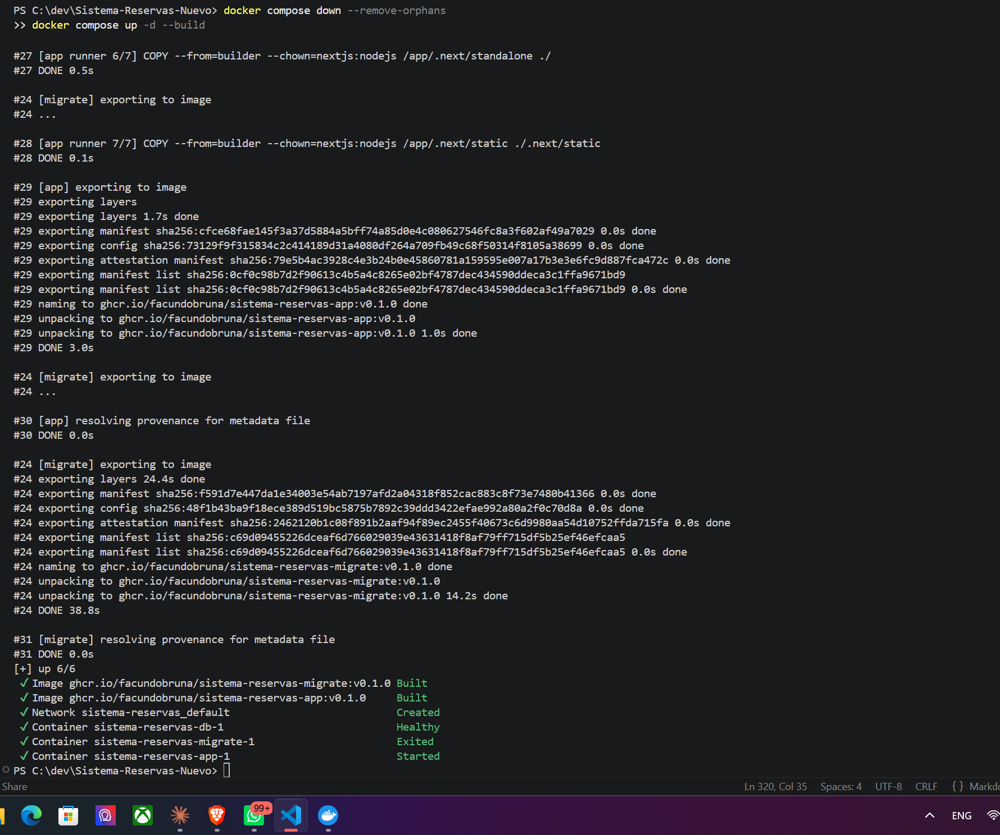
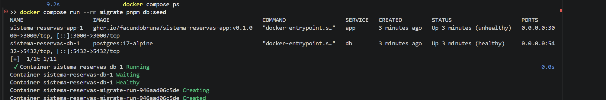
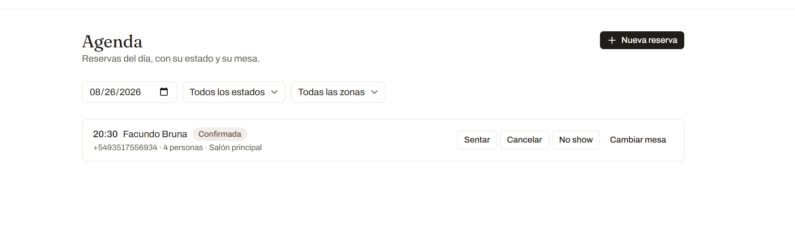
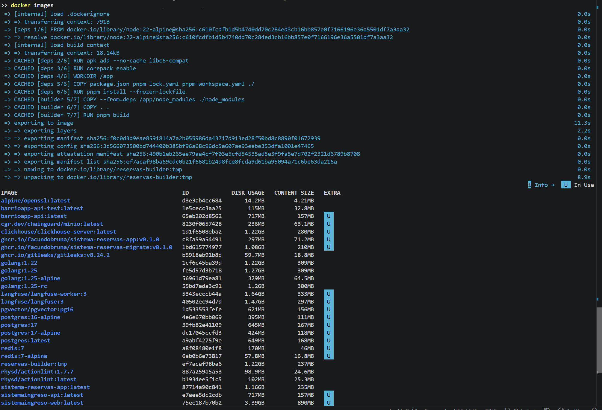
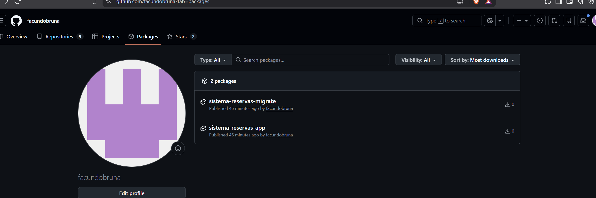
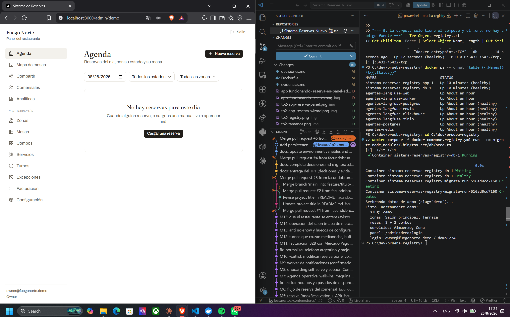

# Evidencias — Ingeniería del Software 3 (UCC 2026)

Capturas y salidas que respaldan cada TP. Se acumulan hacia abajo, igual que `decisiones.md`.

---

## TP1 — Git colaborativo

### 1. Push directo a `main` rechazado


Intento de `git push` directo sobre `main` estando parado en la rama protegida. GitHub lo rechaza
con `protected branch hook declined`: la regla exige que todo cambio entre por Pull Request, y con
*Do not allow bypassing* activado alcanza **también al dueño del repositorio**. Una protección que
el administrador puede saltear no protege nada.

Comando ejecutado:

```
echo "test" >> README.md
git commit -am "test: intento de push directo"
git push
```

### 2. El Pull Request de la rama B no se puede mergear: conflicto


`feature/titulo-a` y `feature/titulo-b` salieron las dos de `main` y modificaron la misma línea del
`README.md`. Una vez mergeada A, GitHub detecta que B ya no se puede integrar automáticamente y
deshabilita el botón de merge hasta resolver.

### 3. Los marcadores del conflicto


El editor de resolución muestra las dos versiones del fragmento separadas por `<<<<<<<`, `=======` y
`>>>>>>>`. Arriba la versión de mi rama, abajo la que ya está en `main`. Resolver es decidir el
contenido final y borrar los marcadores, no ejecutar un comando.

### 4. Release `v1.0.0` publicada


Tag anotado `v1.0.0` sobre `main` y su release publicada con las notas de qué incluye esta versión.
Semver: `MAJOR.MINOR.PATCH` — primera versión estable de la entrega.

---

## TP2 — Contenedores

### 1. `docker compose up -d` desde cero y el sistema funcionando

Arranque completo siguiendo el README en una máquina limpia: `cp .env.example .env` y
`docker compose up -d --build`.

```text
[+] down 4/4
 ✔ Container sistema-reservas-app-1  Removed  0.1s
 ✔ Container sistema-reservas-migrate-1 Removed  0.3s
 ✔ Container sistema-reservas-db-1  Removed  0.6s
 ✔ Network sistema-reservas_default  Removed  0.4s
#29 naming to ghcr.io/facundobruna/sistema-reservas-app:v0.1.0 done
#24 naming to ghcr.io/facundobruna/sistema-reservas-migrate:v0.1.0 done
[+] up 6/6
 ✔ Image ghcr.io/facundobruna/sistema-reservas-migrate:v0.1.0 Built  68.6s
 ✔ Image ghcr.io/facundobruna/sistema-reservas-app:v0.1.0  Built  68.6s
 ✔ Container sistema-reservas-db-1  Healthy  8.5s
 ✔ Container sistema-reservas-migrate-1  Exited  9.1s
 ✔ Container sistema-reservas-app-1  Started  9.2s
```

> **Nota sobre la transcripción.** Se omitió la traza completa de BuildKit (las ~250 líneas de
> `#1 … #31` con cada capa y su tiempo) y se dejó el resumen de compose, que es lo que muestra el
> comportamiento evaluable. La traza completa se puede reproducir con
> `docker compose --progress plain build`.

| Dónde mirar | Qué prueba |
|---|---|
| `Image …-migrate:v0.1.0 Built` y `…-app:v0.1.0 Built` | Las dos imágenes se construyen desde el `Dockerfile`, con los nombres y el tag con que después se publican. |
| `Container …-db-1  Healthy` | La base no solo arrancó: pasó el `pg_isready`. `depends_on` por sí solo esperaría únicamente a que el contenedor exista. |
| `Container …-migrate-1  Exited` | El contenedor de migraciones corrió y terminó. No es un servicio: es de un solo uso. |
| `Container …-app-1  Started` **después** de los dos anteriores | El orden lo impone el compose: la app no arranca hasta que la base está sana y el esquema aplicado. |





`docker compose ps`: `db` y `app` en `healthy`, `migrate` en `Exited (0)` — terminó bien y salió.




Flujo completo contra el sistema contenerizado: la reserva se crea desde el wizard público
(`/r/demo`), viaja por la API de Next, se escribe en Postgres —que corre en **otro contenedor**, al
que la app le habla por el nombre de servicio `db`— y aparece en la agenda del panel del restaurante
(`/admin/demo/login`). Front, back y base, cada uno en su lugar, hablándose por la red de compose.

### 2. Prueba de persistencia

> **Por qué esta evidencia va en texto y no en captura.** La prueba consiste en comparar la *misma
> fila* antes y después de destruir los contenedores, y lo que la identifica es el `id` (un UUID) y
> el `created_at`. En una captura de terminal esas columnas quedan cortadas o ilegibles, y son
> justamente el dato que prueba que la reserva es la misma y no una recreada. El enunciado admite
> "capturas **o salidas**": acá la salida es la evidencia más fuerte.

Secuencia ejecutada de corrido, con una reserva ya creada desde el wizard público. La consulta es
siempre la misma:

```sql
select id, party_size, starts_at, status, created_at from reservation order by created_at desc limit 3;
```

```text
=== 1. La reserva existe ===
                  id                  | party_size |       starts_at        |  status   |          created_at
--------------------------------------+------------+------------------------+-----------+-------------------------------
 b248894e-a09b-4a6c-ab75-ca0ca485d2ba |          4 | 2026-08-28 00:00:00+00 | confirmed | 2026-08-26 18:31:01.671761+00
(1 row)

=== 2. docker compose down ===
  Container sistema-reservas-app-1 Stopping

 Container sistema-reservas-app-1 Stopped
 Container sistema-reservas-app-1 Removing
 Container sistema-reservas-app-1 Removed
 Container sistema-reservas-migrate-1 Stopping
 Container sistema-reservas-migrate-1 Stopped
 Container sistema-reservas-migrate-1 Removing
 Container sistema-reservas-migrate-1 Removed
 Container sistema-reservas-db-1 Stopping
 Container sistema-reservas-db-1 Stopped
 Container sistema-reservas-db-1 Removing
 Container sistema-reservas-db-1 Removed
 Network sistema-reservas_default Removing
 Network sistema-reservas_default Removed
DRIVER    VOLUME NAME
local     sistema-reservas-nuevo_db_data
local     sistema-reservas_db_data
local     sistema-reservas_reservas-postgres-data
=== 3. up -d otra vez: la MISMA reserva sigue ahi ===
  Network sistema-reservas_default Creating

 Network sistema-reservas_default Created
 Container sistema-reservas-db-1 Creating
 Container sistema-reservas-db-1 Created
 Container sistema-reservas-migrate-1 Creating
 Container sistema-reservas-migrate-1 Created
 Container sistema-reservas-app-1 Creating
 Container sistema-reservas-app-1 Created
 Container sistema-reservas-db-1 Starting
 Container sistema-reservas-db-1 Started
 Container sistema-reservas-db-1 Waiting
 Container sistema-reservas-db-1 Healthy
 Container sistema-reservas-migrate-1 Starting
 Container sistema-reservas-migrate-1 Started
 Container sistema-reservas-db-1 Waiting
 Container sistema-reservas-migrate-1 Waiting
 Container sistema-reservas-db-1 Healthy
 Container sistema-reservas-migrate-1 Exited
 Container sistema-reservas-app-1 Starting
 Container sistema-reservas-app-1 Started
 Container sistema-reservas-migrate-1 Waiting
 Container sistema-reservas-app-1 Waiting
 Container sistema-reservas-db-1 Waiting
 Container sistema-reservas-migrate-1 Exited
 Container sistema-reservas-db-1 Healthy
 Container sistema-reservas-app-1 Healthy
                  id                  | party_size |       starts_at        |  status   |          created_at
--------------------------------------+------------+------------------------+-----------+-------------------------------
 b248894e-a09b-4a6c-ab75-ca0ca485d2ba |          4 | 2026-08-28 00:00:00+00 | confirmed | 2026-08-26 18:31:01.671761+00
(1 row)

=== 4. docker compose down -v: se lleva el volumen ===
  Container sistema-reservas-app-1 Stopping

 Container sistema-reservas-app-1 Stopped
 Container sistema-reservas-app-1 Removing
 Container sistema-reservas-app-1 Removed
 Container sistema-reservas-migrate-1 Stopping
 Container sistema-reservas-migrate-1 Stopped
 Container sistema-reservas-migrate-1 Removing
 Container sistema-reservas-migrate-1 Removed
 Container sistema-reservas-db-1 Stopping
 Container sistema-reservas-db-1 Stopped
 Container sistema-reservas-db-1 Removing
 Container sistema-reservas-db-1 Removed
 Volume sistema-reservas_db_data Removing
 Network sistema-reservas_default Removing
 Volume sistema-reservas_db_data Removed
 Network sistema-reservas_default Removed
DRIVER    VOLUME NAME
local     sistema-reservas-nuevo_db_data
local     sistema-reservas_reservas-postgres-data
=== 5. up -d: la base arranca vacia ===
  Network sistema-reservas_default Creating

 Network sistema-reservas_default Created
 Volume sistema-reservas_db_data Creating
 Volume sistema-reservas_db_data Created
 Container sistema-reservas-db-1 Creating
 Container sistema-reservas-db-1 Created
 Container sistema-reservas-migrate-1 Creating
 Container sistema-reservas-migrate-1 Created
 Container sistema-reservas-app-1 Creating
 Container sistema-reservas-app-1 Created
 Container sistema-reservas-db-1 Starting
 Container sistema-reservas-db-1 Started
 Container sistema-reservas-db-1 Waiting
 Container sistema-reservas-db-1 Healthy
 Container sistema-reservas-migrate-1 Starting
 Container sistema-reservas-migrate-1 Started
 Container sistema-reservas-migrate-1 Waiting
 Container sistema-reservas-db-1 Waiting
 Container sistema-reservas-db-1 Healthy
 Container sistema-reservas-migrate-1 Exited
 Container sistema-reservas-app-1 Starting
 Container sistema-reservas-app-1 Started
 Container sistema-reservas-app-1 Waiting
 Container sistema-reservas-db-1 Waiting
 Container sistema-reservas-migrate-1 Waiting
 Container sistema-reservas-db-1 Healthy
 Container sistema-reservas-migrate-1 Exited
 Container sistema-reservas-app-1 Healthy
 reservas
----------
        0
(1 row)
```

#### Cómo se lee esta salida

| Dónde mirar | Qué prueba |
|---|---|
| **Paso 1 vs. paso 3** — `b248894e-a09b-4a6c-ab75-ca0ca485d2ba`, creada `18:31:01.671761`, aparece **idéntica** en los dos | Es la misma fila. `docker compose down` destruyó el contenedor de la base y la reserva sobrevivió: los datos no viven en la capa escribible del contenedor sino en el volumen `db_data`. |
| **`docker volume ls` del paso 2** — `sistema-reservas_db_data` sigue listado después del `down` | El volumen es independiente del ciclo de vida del contenedor. Por eso `down` + `up -d` no pierde nada. |
| **`docker volume ls` del paso 4** — el volumen ya no aparece | La bandera `-v` de `docker compose down -v` es la que se lleva los volúmenes. Es la diferencia entre "apagar" y "borrar". |
| **Paso 5** — el `count` da `0` pero la consulta **no falla** | La tabla existe: al levantar sobre un volumen nuevo, el contenedor de migraciones se ejecutó de nuevo y recreó el esquema desde cero sobre una base virgen. Si las migraciones no hubieran corrido, `psql` habría contestado `relation "reservation" does not exist`. |

> Los otros dos volúmenes que aparecen en el listado (`sistema-reservas-nuevo_db_data` y
> `sistema-reservas_reservas-postgres-data`) son restos de iteraciones anteriores de este mismo
> trabajo, de cuando el compose todavía no declaraba un nombre de proyecto. No pertenecen a este
> sistema y no intervienen en la prueba: el único que aparece y desaparece es
> `sistema-reservas_db_data`.

> **Nota sobre la transcripción.** Se quitaron los bloques `NativeCommandError` que PowerShell
> intercala: Docker escribe su progreso por *stderr*, y PowerShell lo envuelve como si fuera un
> error aunque el comando termine bien. La salida de Docker y de `psql` está completa y sin editar.

**Qué persiste y qué no, en este sistema:** solo la base. Los contenedores de la app y de migraciones
no guardan estado a propósito — se pueden destruir y recrear sin perder nada, que es la condición
para poder desplegarlos en un entorno de QA o producción.

### 3. Tamaño de la imagen final contra la de build



Salida de `docker images` comparando la imagen que se publica (`sistema-reservas-app`, etapa
`runner`) con la etapa de compilación (`reservas-builder`, construida aparte con
`docker build --target builder`).

La diferencia es exactamente lo que el multi-stage deja afuera: pnpm, las `devDependencies`, el
código fuente TypeScript y el toolchain de compilación. Solo la imagen chica es la que viaja al
registry en cada release y la que se descarga en cada despliegue — y es también la que tiene menos
superficie de ataque, porque un compilador y el código fuente adentro de un contenedor de producción
son cosas que un atacante agradece.

### 4. Imágenes publicadas en el registry

Las dos imágenes están publicadas en GitHub Container Registry con tag `v0.1.0` y visibilidad
pública, vinculadas a este repositorio mediante la etiqueta OCI
`org.opencontainers.image.source` del `Dockerfile`:

- `ghcr.io/facundobruna/sistema-reservas-app:v0.1.0` — digest `sha256:c8fa59a5…`
- `ghcr.io/facundobruna/sistema-reservas-migrate:v0.1.0` — digest `sha256:1bd61577…`



#### Las capas se comparten entre imágenes

Extracto del `docker push` de la segunda imagen:

```text
The push refers to repository [ghcr.io/facundobruna/sistema-reservas-migrate]
529857829886: Pushed
3f75213250a0: Pushed
efbef6f9e333: Mounted from facundobruna/sistema-reservas-app
95d689b98c52: Pushed
1354aa71f038: Mounted from facundobruna/sistema-reservas-app
a2980c1fee17: Mounted from facundobruna/sistema-reservas-app
53c8fbc704e8: Mounted from facundobruna/sistema-reservas-app
ae8a7256a1e5: Pushed
16da5a640377: Mounted from facundobruna/sistema-reservas-app
55afa1ecc21d: Mounted from facundobruna/sistema-reservas-app
v0.1.0: digest: sha256:1bd615774977087c8da2baea20098716d9e622032d559bbc91adbc78461c1edb size: 856
```

De las diez capas, **seis no se subieron**: el registry ya las tenía y las montó desde la otra
imagen. Las dos parten de `node:22-alpine` y comparten la etapa `deps`, así que comparten las capas
correspondientes — que se identifican por su hash, no por a qué imagen pertenecen. Es el sistema de
capas funcionando, y la razón por la que ordenar bien el `Dockerfile` (copiar `package.json` antes
que el código) importa tanto: cambiar una línea de código no invalida la capa de dependencias.

#### Prueba de que el `docker-compose.registry.yml` sirve de verdad

Levantar la variante del registry teniendo las imágenes en la máquina **no prueba nada**: compose
usa la copia local y nunca toca el registry. Por eso la prueba se hizo borrando las imágenes locales
y **cerrando sesión** en `ghcr.io`: si igual las baja, es porque son públicas de verdad. Y se hizo
en una carpeta que solo contiene el archivo de compose y el `.env` — sin una línea de código fuente,
que es la situación de un servidor de QA.

```text
=== 0. La carpeta solo tiene el compose y el .env: no hay codigo fuente ===

Name                        Length
----                        ------
.env                          2371
docker-compose.registry.yml   2197
registry.txt                   156

=== 1. Bajar el stack y borrar las imagenes locales ===
  Container sistema-reservas-registry-app-1 Stopping

 Container sistema-reservas-registry-app-1 Stopped
 Container sistema-reservas-registry-app-1 Removing
 Container sistema-reservas-registry-app-1 Removed
 Container sistema-reservas-registry-migrate-1 Stopping
 Container sistema-reservas-registry-migrate-1 Stopped
 Container sistema-reservas-registry-migrate-1 Removing
 Container sistema-reservas-registry-migrate-1 Removed
 Container sistema-reservas-registry-db-1 Stopping
 Container sistema-reservas-registry-db-1 Stopped
 Container sistema-reservas-registry-db-1 Removing
 Container sistema-reservas-registry-db-1 Removed
 Volume sistema-reservas-registry_db_data Removing
 Network sistema-reservas-registry_default Removing
 Volume sistema-reservas-registry_db_data Removed
 Network sistema-reservas-registry_default Removed
Untagged: ghcr.io/facundobruna/sistema-reservas-app:v0.1.0
Deleted: sha256:c8fa59a544913f4542cdfdb35e9aaeeaad046440ca48db33c72a9e2c3aa9c163
Untagged: ghcr.io/facundobruna/sistema-reservas-migrate:v0.1.0
Deleted: sha256:1bd615774977087c8da2baea20098716d9e622032d559bbc91adbc78461c1edb
=== 2. Sin credenciales: si igual las baja, son publicas ===
Removing login credentials for ghcr.io
=== 3. Levantar bajando las imagenes del registry ===
  Image ghcr.io/facundobruna/sistema-reservas-migrate:v0.1.0 Pulling

 Image ghcr.io/facundobruna/sistema-reservas-app:v0.1.0 Pulling
 ae8a7256a1e5 Pulling fs layer 0B
 3f75213250a0 Pulling fs layer 0B
 1354aa71f038 Pulling fs layer 0B
 529857829886 Pulling fs layer 0B
 ae8a7256a1e5 Already exists 0B
 3f75213250a0 Already exists 0B
 1354aa71f038 Already exists 0B
 529857829886 Already exists 0B
 1354aa71f038 Pull complete 0B
 ad17f8b5e867 Pulling fs layer 0B
 64a3e35df017 Pulling fs layer 0B
 66ff05ade7f0 Pulling fs layer 0B
 928401394337 Pulling fs layer 0B
 ad17f8b5e867 Already exists 0B
 66ff05ade7f0 Already exists 0B
 928401394337 Already exists 0B
 64a3e35df017 Already exists 0B
 66ff05ade7f0 Pull complete 0B
 928401394337 Pull complete 0B
 64a3e35df017 Pull complete 0B
 95d689b98c52 Download complete 0B
 ad17f8b5e867 Pull complete 0B
 3261f0275893 Download complete 0B
 Image ghcr.io/facundobruna/sistema-reservas-app:v0.1.0 Pulled
 3f75213250a0 Pull complete 0B
 529857829886 Pull complete 0B
 ae8a7256a1e5 Pull complete 0B
 Image ghcr.io/facundobruna/sistema-reservas-migrate:v0.1.0 Pulled
 Network sistema-reservas-registry_default Creating
 Network sistema-reservas-registry_default Created
 Volume sistema-reservas-registry_db_data Creating
 Volume sistema-reservas-registry_db_data Created
 Container sistema-reservas-registry-db-1 Creating
 Container sistema-reservas-registry-db-1 Created
 Container sistema-reservas-registry-migrate-1 Creating
 Container sistema-reservas-registry-migrate-1 Created
 Container sistema-reservas-registry-app-1 Creating
 Container sistema-reservas-registry-app-1 Created
 Container sistema-reservas-registry-db-1 Starting
 Container sistema-reservas-registry-db-1 Started
 Container sistema-reservas-registry-db-1 Waiting
 Container sistema-reservas-registry-db-1 Healthy
 Container sistema-reservas-registry-migrate-1 Starting
 Container sistema-reservas-registry-migrate-1 Started
 Container sistema-reservas-registry-migrate-1 Waiting
 Container sistema-reservas-registry-db-1 Waiting
 Container sistema-reservas-registry-db-1 Healthy
 Container sistema-reservas-registry-migrate-1 Exited
 Container sistema-reservas-registry-app-1 Starting
 Container sistema-reservas-registry-app-1 Started
 Container sistema-reservas-registry-migrate-1 Waiting
 Container sistema-reservas-registry-app-1 Waiting
 Container sistema-reservas-registry-db-1 Waiting
 Container sistema-reservas-registry-migrate-1 Exited
 Container sistema-reservas-registry-db-1 Healthy
 Container sistema-reservas-registry-app-1 Healthy
=== 4. Estado final ===
NAME                              IMAGE                                              COMMAND                  SERVICE   CREATED          STATUS                    PORTS
sistema-reservas-registry-app-1   ghcr.io/facundobruna/sistema-reservas-app:v0.1.0   "docker-entrypoint.s…"   app       13 seconds ago   Up 5 seconds (healthy)    0.0.0.0:3000->3000/tcp, [::]:3000->3000/tcp
sistema-reservas-registry-db-1    postgres:17-alpine                                 "docker-entrypoint.s…"   db        14 seconds ago   Up 12 seconds (healthy)   0.0.0.0:5432->5432/tcp, [::]:5432->5432/tcp
```

| Dónde mirar | Qué prueba |
|---|---|
| **Paso 0** — el listado tiene `docker-compose.registry.yml` y `.env`, nada más | No hay `src/`, ni `Dockerfile`, ni `package.json`. El sistema se levanta desde artefactos publicados, no desde el código. |
| **Paso 1** — `Deleted: sha256:c8fa59a5…` y `sha256:1bd61577…` | Las imágenes se borraron de la máquina. Sin esto, el pull del paso 3 nunca habría ocurrido. |
| **Paso 2** — `Removing login credentials for ghcr.io` | A partir de acá no hay credenciales. Lo que siga es un acceso anónimo. |
| **Paso 3** — `Pulling` → `Pulled` en las dos imágenes, sin estar logueado | Las imágenes son públicas. No hace falta confiar en lo que dice la configuración de GitHub: se comprobó. |
| **Paso 3** — varias capas dicen `Already exists` | Son las capas base de `node:22-alpine`, que seguían en la máquina por otras imágenes. Docker no vuelve a bajar lo que ya tiene: descarga por capa, no por imagen. |
| **Paso 4** — `app` y `db` en `(healthy)`, `migrate` no aparece | El sistema quedó arriba consumiendo las imágenes del registry. `migrate` no está listado porque terminó y salió: es un contenedor de un solo uso, no un servicio. |



`localhost:3000` servido por el stack levantado desde ghcr.io, sin código fuente en la carpeta y sin
haber compilado nada.

> **Nota sobre la transcripción.** Se quitaron los bloques `NativeCommandError` que PowerShell
> intercala —Docker escribe su progreso por *stderr* y PowerShell lo envuelve como error aunque el
> comando termine bien— y las líneas repetidas de progreso de descarga (`Extracting NB`), que son
> cientos y no aportan. Los estados de cada capa (`Pulling fs layer`, `Already exists`,
> `Pull complete`) están completos y sin editar.
